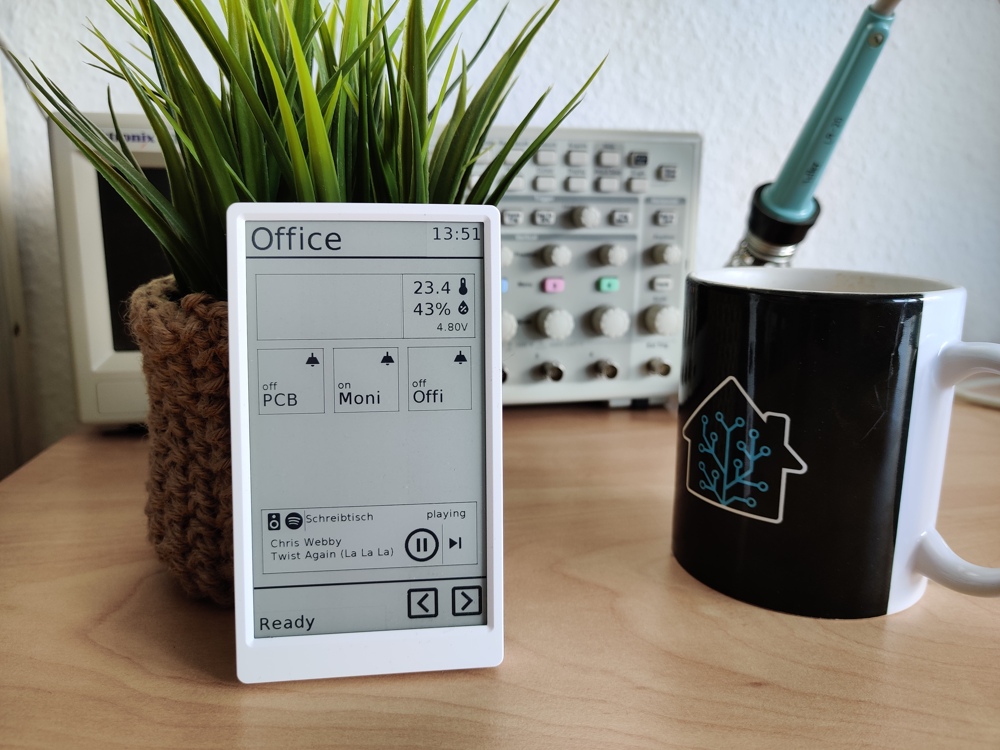

# m5paper-homeassistant-remote

UI for m5paper device to control a home assistant over rest and mqtt

*This project is in no relation with [M5Stack](https://m5stack.com/) or [Home Assistant](https://www.home-assistant.io/). The icons used in this project are from [Material Design Icons (mdi)](https://github.com/Templarian/MaterialDesign). Feel free to use this project for your own non-comercial purposes.*

## To-do

- [x] Read configuration from a file
- [ ] Sleep mode and wakeup function
- [ ] Time with leading zero

## Instructions

Programming and device management is done with Visual Studio Code with M5Stack extension

- Copy main.py and HomeAssistant.py to the root directory of the device
- Copy icons to "res/*" 
- Create "secret.json" with your credentials for wifi, home assistant and mqtt

## Idea
The goal of this project is to provide an adaptable user interface for home assistant on the m5paper device. 
The m5paper is an esp32 based microcontroller with a 4.7" E-INK touchscreen, a battery and a lot of other peripherals. 
As my Home Assistant is a playground and evolving quiet a lot during time I would like to adapt the UI to my needs as easy as possible.

## Base-Layout
The basic layout was designed in UI-Flow by placing labels, images and frames. The initial template is stored in (documentation)[documentation]

## Logic
- Define the entities and button positions in a configuration
- Each button instance fetches some data from home assistant over the REST API for ex. "friendly-name", "state"
- The device is listening for state changes over mqtt statestream integration
